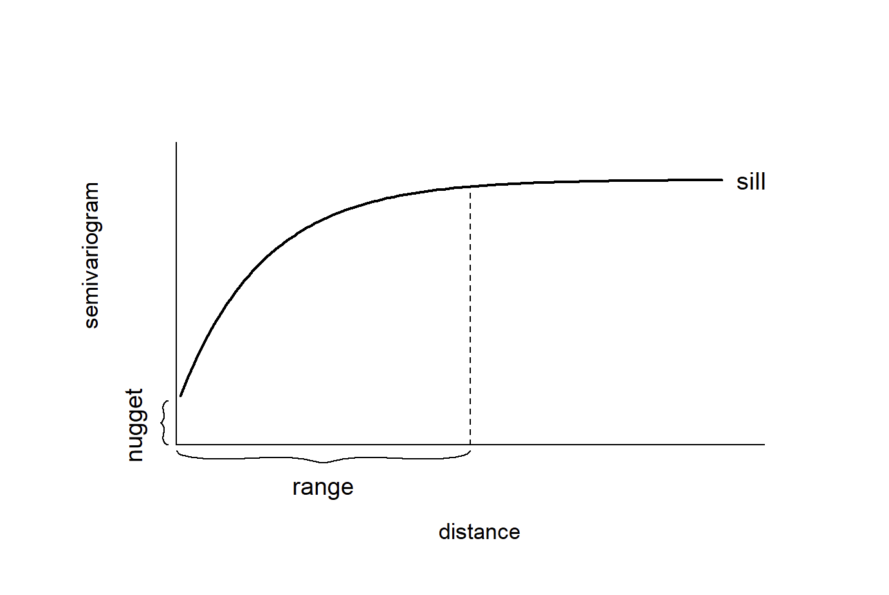

# Continuous Surfaces

Some phenomena are spatially continuous, meaning they are present at every location rather than confined to discrete points.

In many cases, however, data about these continuous variables are only collected at discrete locations (i.e. weather monitoring stations, stream gauges, sample sites). Therefore, an important task is to predict these continuous values at unsampled locations. This is called spatial interpolation. In this tutorial we will explore several strategies for interpolating

In this tutorial, we will explore several strategies for interpolating data. Ultimately, the choice of interpolation method depends on several factors, including the strength and scale of autocorrelation, the density of sampling locations, the need for estimates of uncertainty, and the computational complexity.

We will use data from weather stations across North Carolina during a 2025 heat wave (July 30, 2025). The data is from the [North Carolina State Climate Office](https://products.climate.ncsu.edu/cardinal/user/)

**To follow along with this tutorial, make a new .Rmd document. As you move through the tutorial add chunks, headers, and relevant text to your document.**

## Reading in Data

```{r, include = F}
library(sf)
library(tidyverse)
library(gstat)
library(sp)
library(terra)
library(tmap)
library(INLA)

options(scipen = 999)

#heatwave data
heatwave_temp <- st_read("https://drive.google.com/uc?export=download&id=1tZQU5NwZ3Z1lBtFbJTvM7clB1z0sXMI9") |> distinct()

#nc boundaries
nc_boundaries <- st_read("https://drive.google.com/uc?export=download&id=1SNy838Q7f7rvL6TFLmIZm-sKyRO7Htjw") 

```

```{r, warning = F, eval = F}
library(sf)
library(tidyverse)
library(gstat)
library(sp)
library(terra)
library(tmap)
library(INLA)

options(scipen = 999)

#heatwave data
heatwave_temp <- st_read("https://drive.google.com/uc?export=download&id=1tZQU5NwZ3Z1lBtFbJTvM7clB1z0sXMI9") |> distinct()

#nc boundaries
nc_boundaries <- st_read("https://drive.google.com/uc?export=download&id=1SNy838Q7f7rvL6TFLmIZm-sKyRO7Htjw") 
```

## Spatial Structure

To predict continuous surfaces, we must assume that the underlying phenomenon has a predictable spatial structure. Methods for surface prediction rely on spatial autocorrelation. When a variable shows little or no spatial autocorrelation, it is not a good candidate for continuous surface prediction.

Let's first look at our temperature values:

```{r}
tm_shape(heatwave_temp) + tm_dots("value", tm_scale_intervals(style = "quantile", values = "-brewer.rd_yl_gn")) + tm_shape(nc_boundaries) + tm_borders()
```

Just based on the pattern visible on the map, this variable clearly is autocorrelated. However, if we were unsure, we could calculate a Moran's I.

## Methods for Interpolation

### IDW

Inverse Distance Weighting (IDW) is a deterministic interpolation method that predicts values at unsampled locations as a weighted average of nearby observations. Points closer to the prediction location receive more weight than points farther away. IDW is a simple method that is often used to generate an exploratory surface.

IDW does not estimate an underlying statistical model of spatial dependence. Instead, it assumes that similarity decreases with distance and uses that assumption directly to compute predictions.

The main parameter in IDW is the inverse distance power (IDP), which controls how rapidly influence declines as distance increases. Lower IDP (closer to 1) values allow more distant observations to contribute to predictions, while higher IDP (greater than 3) values emphasize local variation and weight nearby points more heavily.

To select an appropriate IDP, we can compare several reasonable values using something called k-fold cross-validation. This approach iteratively divides the dataset into training and testing subsets and withholds part of the data. Predictions are generated using the remaining observations and value with the lowest prediction error (usually using RMSE) is selected.

```{r, message=F, warning=F, results = F}
#turn sf objects into sp objects for gstats
heatwave_sp <- as(heatwave_temp, "Spatial")
nc_sp <- as(nc_boundaries, "Spatial")

#test values
idp_vals <- c(1, 1.5, 2, 2.5, 3, 4)

#store results
idw_cv_results <- data.frame(
  idp = idp_vals,
  ME = NA,
  MAE = NA,
  RMSE = NA
)

#loop that calculates prediction error at all of the test vallues
for (i in seq_along(idp_vals)) {
  
  idw_model <- gstat(
    formula = value ~ 1, #idw formula
    locations = heatwave_sp,
    set = list(idp = idp_vals[i])
  )
  
  cv <- gstat.cv(
    object = idw_model,
    nfold = 5   #5-fold cross-validation
  )
  
  idw_cv_results$ME[i] <- mean(cv$residual, na.rm = TRUE)
  idw_cv_results$MAE[i] <- mean(abs(cv$residual), na.rm = TRUE)
  idw_cv_results$RMSE[i] <- sqrt(mean(cv$residual^2, na.rm = TRUE))
}
```

```{r}
#view benchmarking results
idw_cv_results
```

**Q1: Based on our benchmarking results, what IDP should we choose? (Note that the RMSE might vary slightly depending on the simulations)**

To actually create a prediction surface, we first need to create a prediction grid, which defines the locations where we want to estimate temperature values. The grid (raster) divides the study area into cells, and the interpolation method then will generate a predicted value for each cell. The size of each pixel determines the spatial resolution of the final surface. Smaller pixels produce a smoother, more detailed surface but require more computation, while larger pixels produce a coarser surface with less spatial detail. In this tutorial, we create a grid that covers the North Carolina boundary and will use this same grid for all interpolation methods so that the resulting prediction surfaces can be compared directly.

```{r}
# create a regular prediction grid. We say we want 2000 pixels
grd <- as.data.frame(spsample(nc_sp, "regular", n = 2000))

#set grid coordinates
names(grd) <- c("X", "Y")
coordinates(grd) <- c("X", "Y")
gridded(grd) <- TRUE
fullgrid(grd) <- TRUE

#assign CRS (which is 2264, you MUST use a projected coordinate system for interpolation)
crs(grd) <- crs(heatwave_sp)

# run IDW interpolation using the best IDP from cross-validation
heatwave_idw <- idw(
  formula = value ~ 1,
  locations = heatwave_sp,
  newdata = grd,
  idp = 2
)

#rasterize interpolation output
r <- rast(heatwave_idw)

#mask to North Carolina boundaries
r_m <- mask(r, nc_boundaries)

#map interpolated temperatures
tm_shape(r_m) +
  tm_raster(
    col = "var1.pred",
    col.scale = tm_scale_intervals(
      values = "-rd_yl_gn",
      style = "quantile"
    )
  )
```

**Q2: Re-run the IDW using a different IDP and compare the results.**

### Kriging

Kriging assumes that the observed data are realizations of an underlying spatial random field, meaning the values we measure at specific locations are part of a continuous stochastic process across space. Unlike IDW, which determines prediction weights solely based on distance, kriging uses a variogram model to describe how strongly observations are related to one another across space. This model characterizes how spatial similarity declines as the distance between locations increases, and kriging uses this relationship to determine the weights applied to nearby observations when predicting values at unsampled locations.

To understand the spatial structure of the data, we first calculate an empirical variogram on our data. The empirical variogram summarizes how differences between observed values change with distance by computing the average semivariance between pairs of observations at different separation distances.

```{r}
#compute empirical variogram
v <- variogram(value ~ 1, data = heatwave_sp)

#plot empirical variogram
plot(v)
```

We then match the overall shape of the empirical variogram to a theoretical variogram model, which provides a smooth mathematical function describing the spatial dependence structure of the data. The most commonly used models include the spherical, exponential, and Gaussian variogram models.

```{r}
show.vgms(par.strip.text = list(cex = 0.75))

```

In our case, we will use a spherical variogram model.

Variogram models are typically described using three main parameters: the nugget, the sill, and the range. When fitting a variogram model, we provide initial estimates for these parameters so the fitting algorithm has a starting point. The goal is to roughly match the overall shape of the empirical variogram to one of the available theoretical models.

Once these starting values are specified, the fitting procedure refines the parameters to produce a variogram model that best represents the spatial structure observed in the data. This fitted model is then used by the kriging algorithm to determine the weights applied to nearby observations when generating predictions.



In our case, we will define the nugget at 10, the sill at 17, and the range at 150000

```{r}
#specify an initial variogram model
vgm_initial <- vgm(
  psill = 17,
  model = "Sph",
  range = 150000,
  nugget = 10
)

#fit empirical to initial model
vgm_fit <- fit.variogram(v, vgm_initial)

#plot fitted variogram model 
plot(v, vgm_fit)


#fit kriging
krig_pred <- krige(
  formula = value ~ 1,
  locations = heatwave_sp,
  newdata = grd,
  model = vgm_fit
)

#rasterize predictions
krig_rast <- rast(krig_pred)

#mask to North Carolina boundary
krig_mask <- mask(krig_rast, nc_boundaries)

#map kriging predictions
tm_shape(krig_mask) +
  tm_raster(
    col = "var1.pred",
    col.scale = tm_scale_intervals(
      values = "-rd_yl_gn",
      style = "quantile"
    )
  )

# map kriging prediction variance
tm_shape(krig_mask) +
  tm_raster(
    col = "var1.var",
    col.scale = tm_scale_intervals(
      values = "viridis",
      style = "quantile"
    )
  )
```

**Q3. Compare our kriging results to our IDW. What looks different?**

**Q4. Look at the kriging variance. This represents the uncertainty of the prediction at that location. Taking the square of the variance is the standard error (i.e. if the variance is 17, that means the standard error would be about 4 degrees). What could cause differences in variance across the study region?**

### Bayesian Approach

Instead of estimating interpolation weights directly, a Bayesian approach it treats the underlying spatial pattern as a latent stochastic process that generates the observed data. In this framework, the temperature at each location is modeled as the sum of a global mean and a spatial random effect that varies smoothly across space. The spatial random effect represents the structured spatial dependence that we previously tried to capture with the variogram model in kriging.

The model we will use is the Stochastic Partial Differential Equation (SPDE). This method approximates a continuous spatial field using a triangulated mesh that covers the study region. Each node in the mesh represents part of the spatial process, and the spatial effect is estimated as a weighted combination of these nodes.

This structure is conceptually similar to kriging because both methods assume the data come from a spatial random field and both produce spatial predictions and uncertainty estimates. However, instead of fitting a variogram and solving kriging equations, the Bayesian model estimates the spatial field directly within a hierarchical probabilistic framework and produces posterior distributions for the predicted values.

In our case, we will be using a simple SPDE model with no covariates. This means that the model only estimates an overall mean temperature and a spatial random effect that varies smoothly across space. In other words, the temperature at any location is modeled as the sum of a global intercept and the spatial field.

```{r}
# response and observed coordinates
y <- heatwave_temp$value
coo <- st_coordinates(heatwave_temp)

#prediction coordinates from the existing grid
coords_pred <- coordinates(grd)

# build triangulated mesh over observed locations
# the mesh approximates the continuous spatial field using a network of triangles

mesh <- fmesher::fm_mesh_2d_inla(
  loc = coo,

  # max.edge controls the maximum triangle size in the mesh
  # because our CRS (EPSG:2264) is in feet, these distances are also in feet
  # c(50000, 100000) allows triangles up to ~9.5 miles inside the main data region
  # and ~19 miles in the outer extension of the mesh
  # this keeps the mesh detailed enough to capture statewide temperature patterns
  # while avoiding excessive computation

  max.edge = c(50000, 100000),

  # cutoff prevents very small triangles when observation points are very close
  # if stations are within 10,000 feet (~1.9 miles) of each other,
  # they will not force the mesh to create extremely dense clusters of nodes
  # this helps stabilize the mesh and reduce unnecessary complexity

  cutoff = 10000
)
#plot the mesh
plot(mesh)


```

Now that we have our mesh, we can run our model
```{r}
#dfine the spatial random field using the SPDE formulation.
#this specifies the Matérn covariance structure that describes spatial dependence. Alpha of 2 means controls the smoothness
spde <- inla.spde2.matern(
  mesh = mesh,
  alpha = 2,
  constr = TRUE
)

#index set for the spatial random effect. S is the name of the effect
indexs <- inla.spde.make.index("s", spde$n.spde)

#projection matrices map the mesh nodes onto the grids and the weather statin points
#A_obs links observed station locations to the mesh
#A_pred links prediction grid locations to the mesh
A_obs <- inla.spde.make.A(mesh = mesh, loc = coo)
A_pred <- inla.spde.make.A(mesh = mesh, loc = coords_pred)

#inla uses a stack to organize the response variable, model covariates (we dont have these), spatial random effects, projection matrices

#stack for observed data
stk.e <- inla.stack(
  tag = "est",
  data = list(y = y),
  A = list(1, A_obs),
  effects = list(
    data.frame(intercept = rep(1, nrow(A_obs))),
    s = indexs
  )
)

#stack for predicted locations
stk.p <- inla.stack(
  tag = "pred",
  data = list(y = NA),
  A = list(1, A_pred),
  effects = list(
    data.frame(intercept = rep(1, nrow(A_pred))),
    s = indexs
  )
)
stk.full <- inla.stack(stk.e, stk.p)

# fit Bayesian spatial model. It is just our intercept (which is the global mean) and our spatial random effect
formula <- y ~ 0 + intercept + f(s, model = spde)

#gaussian for contirbous data
res <- inla(
  formula,
  family = "gaussian",
  data = inla.stack.data(stk.full),
  control.predictor = list(
    compute = TRUE,
    A = inla.stack.A(stk.full)
  ),
  control.compute = list(
    return.marginals.predictor = TRUE
  )
)

#extract posterior summaries for prediction locations
index_pred <- inla.stack.index(stk.full, tag = "pred")$data

grd$mean <- res$summary.fitted.values[index_pred, "mean"]
grd$ll <- res$summary.fitted.values[index_pred, "0.025quant"]
grd$ul <- res$summary.fitted.values[index_pred, "0.975quant"]
grd$ci_width <- grd$ul - grd$ll

#rasterize and mask to North Carolina
bayes_rast <- rast(grd)
bayes_mask <- mask(bayes_rast, nc_boundaries)

#posterior mean map
tm_shape(bayes_mask) +
  tm_raster(
    col = "mean",
    col.scale = tm_scale_intervals(
      values = "-rd_yl_gn",
      style = "quantile"
    )
  )

#uncertainty map (credible interval width)
tm_shape(bayes_mask) +
  tm_raster(
    col = "ci_width",
    col.scale = tm_scale_intervals(
      values = "viridis",
      style = "quantile"
    )
  )
```

### Picking a Model 

So, what model do we go with? In practice, the choice often depends on the purpose of the analysis. If the goal is rapid exploration, IDW may be sufficient. If the goal is statistically grounded interpolation with an explicit spatial covariance model, kriging is often a strong choice. If the goal is to model the spatial process directly and obtain full probabilistic uncertainty estimates, a Bayesian spatial model may be preferred. You can also compare interpolation methods using benchmarking, where predictions from each model are evaluated against observed data using techniques such as cross-validation.
